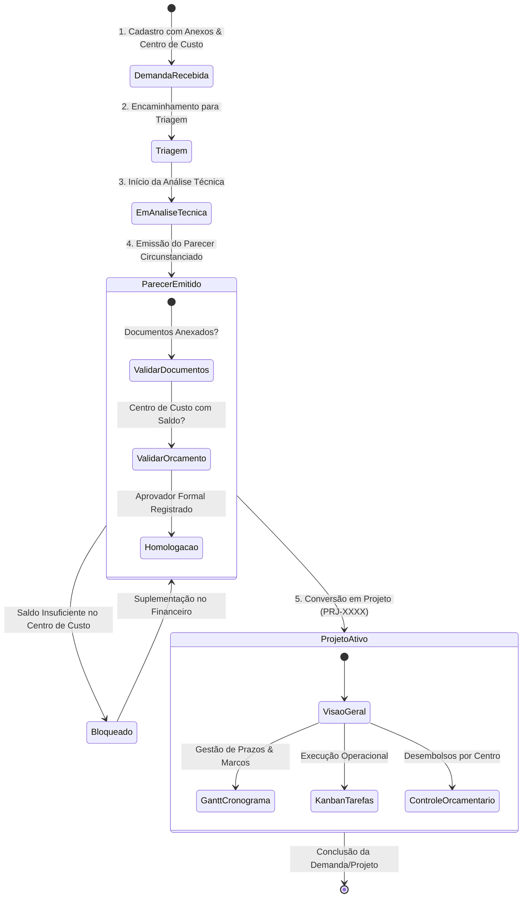

# 🏛️ DOCUMENTO DE ARQUITETURA DO SISTEMA — campanhaPRO (dashBom)

> **Versão:** 2.0.0  
> **Data de Atualização:** Agosto/2026  
> **Repositório:** [https://github.com/dossantoscarlos/dashBom](https://github.com/dossantoscarlos/dashBom)  
> **Branch Principal de Desenvolvimento:** `roddev`

---

## 📑 Índice da Arquitetura

1. [1. Visão Geral e Princípios Arquiteturais](#1-visão-geral-e-princípios-arquiteturais)
2. [2. Stack Tecnológica e Infraestrutura](#2-stack-tecnológica-e-infraestrutura)
3. [3. Arquitetura Modular (/CoreModules)](#3-arquitetura-modular-coremodules)
4. [4. Diagrama Geral de Camadas (Architecture Layers)](#4-diagrama-geral-de-camadas-architecture-layers)
5. [5. Módulos de Negócio e Suas Responsabilidades](#5-módulos-de-negócio-e-suas-responsabilidades)
6. [6. Ciclo de Vida e Governança: Demanda ➔ Projeto](#6-ciclo-de-vida-e-governança-demanda--projeto)
7. [7. Arquitetura Financeira e Governança de Centros de Custo](#7-arquitetura-financeira-e-governança-de-centros-de-custo)
8. [8. Camada de Domínio, Dados e Estado (/lib)](#8-camada-de-domínio-dados-e-estado-lib)
9. [9. Camada de Rotas e APIs (/app e /app/api)](#9-camada-de-rotas-e-apis-app-e-appapi)
10. [10. Segurança, Auditoria e Controle de Acesso (RBAC)](#10-segurança-auditoria-e-controle-de-acesso-rbac)
11. [11. Padrões de Código e Guia de Manutenibilidade](#11-padrões-de-código-e-guia-de-manutenibilidade)

---

## 1. Visão Geral e Princípios Arquiteturais

O **campanhaPRO** é uma plataforma corporativa e analítica projetada para governança pública, articulação eleitoral, controle financeiro transparente de mandatos políticos e execução rigorosa de demandas comunitárias e projetos mandatários.

### Princípios Norteadores da Arquitetura:
- **Modularidade Estrita (High Cohesion, Low Coupling):** Cada funcionalidade vive em seu próprio módulo em `/CoreModules`, podendo ser operada ou incorporada de forma independente.
- **Transacionalidade e Rastreabilidade Absoluta:** Nenhuma ação (seja criação de demanda, aprovação de verba ou avanço de cronograma) ocorre sem trilha de auditoria e parecer técnico registrado.
- **Design System Premium e Responsivo:** Interfaces construídas com Tailwind CSS v4, suporte nativo a Tema Claro e Escuro (Dark Mode), microanimações e gráficos vetoriais de alta densidade de informação.
- **Navegação Bidirecional por Código:** Referências como `DEM-xxxx` e `PRJ-xxxx` operam como hiperlinks inteligentes que transportam o usuário instantaneamente para o contexto correspondente.

---

## 2. Stack Tecnológica e Infraestrutura

```text
┌───────────────────────────────────────────────────────────────────────┐
│                          STACK TECNOLÓGICA                            │
├────────────────────────┬──────────────────────────────────────────────┤
│ Framework Principal    │ Next.js 16.2.7 (App Router & Turbopack)     │
│ Linguagem              │ TypeScript 5.x (Strict Typing)               │
│ Biblioteca de Interface│ React 19.2.4 (Server & Client Components)    │
│ Estilização & UI Tokens│ Tailwind CSS v4 + Vanilla CSS Tokens HSL    │
│ Iconografia            │ Lucide React (1.31+)                         │
│ Gráficos & Visualização│ Recharts (PieChart, BarChart, Responsive)   │
│ Gestão de Formulários  │ React Hook Form + Zod Validations            │
│ Controle de Versão     │ Git / GitHub (Branches: main e roddev)      │
└────────────────────────┴──────────────────────────────────────────────┘
```

---

## 3. Arquitetura Modular (`/CoreModules`)

Conforme definido na diretriz arquitetural do projeto (`AGENTS.md`), **todos os módulos funcionais independentes do sistema residem em `/CoreModules` na raiz do projeto**:

```text
CoreModules/
├── Agenda/              # Calendário eleitoral TSE, compromissos com hora e rota Maps
├── Autoridades/         # Mapeamento de prefeitos, vereadores e lideranças institucionais
├── Campaigns/           # Planejamento estratégico de ações eleitorais e eventos de campanha
├── Dashboard/           # Painel executivo com KPIs globais mandatários e gráficos
├── DemandasProjetos/    # Suíte transacional: Demandas, Pareceres, Gantt, Kanban, RACI
├── Financeiro/          # Orçamentos, Centros de Custo, Contratos (3 marcos) e Contas
├── Locations/           # Mapeamento geográfico de comitês, sedes e pontos de apoio
├── Parecer/             # Emissão de pareceres técnicos e jurídicos de conversão
├── Partners/            # Entidades parceiras, sindicatos e associações apoiadoras
├── Permissions/         # Matriz de cargos e controle de acessos da equipe
├── Profile/             # Preferências de perfil, foto de usuário e tema Claro/Escuro
├── RedeSocial/          # Acompanhamento de redes sociais e engajamento digital
├── Regions/             # Divisão territorial, bairros e metas de votos
├── Reports/             # Relatórios gerenciais baseados em dados reais (CSV/Excel/PDF)
├── Surveys/             # Levantamento de opinião pública e pesquisas eleitorais
├── Tre/                 # Monitoramento TSE em tempo real e consulta de candidatos
├── Users/               # Gestão de contas de usuários e operadores
└── Voluntariado/        # Rede de voluntários, mobilização de militantes e apoiadores
```

---

## 4. Diagrama Geral de Camadas (Architecture Layers)

```mermaid
graph TD
    subgraph UI_WORKSPACE [Camada de Apresentação / Workspace]
        A[ExtJSWorkspace / App Router]
        B[Dashboard Layout & Sidebar]
        C[Central de Notificações & Header]
    end

    subgraph CORE_MODULES [Camada de Negócio - CoreModules]
        D[CoreModules/DemandasProjetos]
        E[CoreModules/Financeiro]
        F[CoreModules/Agenda]
        G[CoreModules/Tre]
        H[Outros CoreModules...]
    end

    subgraph DOMAIN_LAYER [Camada de Domínio & Estado - /lib]
        I[Domain Types /lib/domain]
        J[Data Stores /lib/data]
        K[React Query / Hooks /lib/hooks]
        L[Auth & Sessions /lib/auth]
    end

    subgraph API_LAYER [Camada de Backend / Endpoints Next.js - /app/api]
        M[/api/financeiro]
        N[/api/demandas]
        O[/api/agenda]
        P[/api/tre/*]
        Q[/api/management-contexts/*]
    end

    UI_WORKSPACE --> CORE_MODULES
    CORE_MODULES --> DOMAIN_LAYER
    DOMAIN_LAYER --> API_LAYER
```

---

## 5. Módulos de Negócio e Suas Responsabilidades

### 5.1. Demandas e Projetos (`CoreModules/DemandasProjetos`)
O módulo principal de governança com suporte a 10 telas e visualizações integradas:
1. **Acompanhamento Geral:** Visão executiva em tabela detalhada, tabela compacta, quadro Kanban e linha do tempo com busca e filtros multifacetados.
2. **Cadastro de Demanda:** Registro com CEP automático, upload de documentos técnicos e seleção de centro de custo orçado.
3. **Análise Técnica:** Parecer circunstanciado consolidado, diagnóstico financeiro e homologação formal.
4. **Visão Geral do Projeto:** Indicadores de prazo, equipe, orçamento e entregas.
5. **Quadro Kanban de Tarefas:** Gestão ágil de atividades por fases de execução.
6. **Cronograma em Diagrama de Gantt:** Linha do tempo visual com marcos (*Milestones*), barras hierárquicas, linha de "Hoje" e botão de agendamento na Agenda de Campanha.
7. **Orçamento e Finanças do Projeto:** Alocação orçamentária por categorias e controle de desembolsos.
8. **Equipe & Matriz RACI:** Distribuição de papéis (*Responsible, Accountable, Consulted, Informed*).
9. **Arquivos & Documentos:** Árvore de anexos com versionamento e download.
10. **Histórico & Auditoria:** Trilha detalhada de cada alteração com links clicáveis de rastreabilidade.

### 5.2. Gestão Financeira (`CoreModules/Financeiro`)
Gerencia o fluxo orçamentário e a conformidade legal nos 4 contextos institucionais (*Campanha*, *Mandato*, *Partido*, *Interno*):
- **Visão Geral:** Big Numbers de Arrecadação, Despesas Pagas, Saldo Disponível e Comprometido, com gráfico de fluxo de caixa mensal.
- **Receitas:** Gestão de doações (PF/FEFC), recibos eleitorais e conciliação bancária.
- **Despesas & Solicitações:** Fluxo de aprovação em 4 etapas (*Solicitada*, *Em Validação*, *Aprovada*, *Paga*).
- **Orçamentos & Centros de Custo:** Cadastro de centros de custo com teto orçamentário, dotações por categoria e cálculo dinâmico de saldo disponível e comprometimento em tempo real.
- **Contratos:** Gestão com controle de vigência em 3 marcos temporais (**Início**, **Meio** e **Término**) e vínculo com o centro de custo.
- **Contas Bancárias:** Registro de contas correntes eleitorais e doações, com saldo e chave PIX.
- **Fornecedores:** Cadastro com validação de CNPJ/CPF e certidões.

### 5.3. Agenda & Calendário Eleitoral TSE (`CoreModules/Agenda`)
- **Compromissos Mandatários:** Agendamento com definição obrigatória de hora, local, participantes e link direto para rota no Google Maps.
- **Calendário Oficial do TSE:** Prazos eleitorais oficiais integrados com badge identificador especial.

### 5.4. Inteligência Eleitoral & TRE (`CoreModules/Tre`)
- Monitoramento de dados abertos do TSE/TRE, consulta paginada de candidaturas, prestação de contas públicas e notícias em tempo real.

---

## 6. Ciclo de Vida e Governança: Demanda ➔ Projeto



---

## 7. Arquitetura Financeira e Governança de Centros de Custo

### Regras de Governança Orçamentária:
1. **Origem Exclusiva:** Centros de Custo só podem ser criados ou editados no Módulo Financeiro (`/modulos` ➔ *Financeiro* ➔ *Orçamentos & Centros*).
2. **Diagnóstico em Tempo Real na Demanda:**
   $$\text{Saldo Remanescente} = \text{Saldo Disponível do Centro} - \text{Custo Estimado da Demanda}$$
   $$\text{\% Consumido} = \left(\frac{\text{Custo Estimado}}{\text{Saldo Disponível}}\right) \times 100$$
3. **Bloqueio por Déficit:** Se $\text{Custo Estimado} > \text{Saldo Disponível}$, a conversão em projeto é impedida pelo sistema até que haja aporte financeiro no respectivo centro.
4. **Cálculo dos Big Numbers no Financeiro:**
   - $\text{Total Orçado} = \sum \text{Teto Limite dos Centros de Custo e Dotações}$
   - $\text{Comprometido} = \sum \text{Despesas Solicitadas / Em Validação / Aprovadas} + \sum \text{Orçamentos Empenhados}$
   - $\text{Saldo Disponível} = \text{Teto Orçado} - (\text{Liquidado} + \text{Comprometido})$

---

## 8. Camada de Domínio, Dados e Estado (`/lib`)

- `/lib/domain/`: Interfaces e tipos de dados estritos TypeScript:
  - `demandas-projetos-types.ts`: Modelos de `WorkItem`, `DemandaItem`, `ProjetoItem`, `AuditEvent`.
  - `financeiro-types.ts`: Modelos de `CostCenter`, `Budget`, `Expense`, `Revenue`, `Contract`, `BankAccount`.
- `/lib/data/`:
  - `financeiro-store.ts`: Utilitários monetários com cálculo em centavos inteiros (`toCents`, `fromCents`, `formatCurrencyBR`) para garantir precisão contábil sem erros de ponto flutuante.
- `/lib/hooks/`:
  - `use-demandas-projetos.ts`: Hooks reativos com gerenciamento de estado e cache para listagens, paginação, filtros e mutações.
- `/lib/auth.ts` & `/lib/session.ts`: Controle de sessão e credenciais autenticadas.

---

## 9. Camada de Rotas e APIs (`/app` e `/app/api`)

### Rotas de Interface (App Pages):
- `/modulos`: Espaço de trabalho principal que orquestra e renderiza dinamicamente os `CoreModules`.
- `/dashboard`: Painel executivo principal.
- `/campanhas`, `/relatorios`, `/tre`, `/locais`, `/permissoes`, `/usuarios`: Páginas dedicadas de navegação direta.

### Rotas de API REST (`/app/api`):
- `GET/POST /api/financeiro`: Consulta e movimentações contábeis, receitas, despesas, contratos e centros de custo.
- `GET/POST /api/demandas`: Criação, tramitação, parecer técnico e conversão de demandas.
- `GET/POST /api/agenda`: Compromissos da equipe e sincronização com o Calendário Eleitoral.
- `GET /api/tre/*`: Endpoints de integração com dados do TSE e TRE.
- `GET /api/management-contexts/[contextId]/*`: Endpoints REST paginados e com suporte a filtros de status, prioridade, pesquisa textual e ordenação.

---

## 10. Segurança, Auditoria e Controle de Acesso (RBAC)

1. **Trilha de Auditoria Append-Only:** Todas as modificações geram eventos imutáveis contendo autor, data/hora, valor anterior, novo valor e justificativa.
2. **Matriz de Permissões (RBAC):** Módulo `CoreModules/Permissions` controla permissões granulares de visualização, edição, aprovação financeira e exportação.
3. **Isolamento de Contexto:** Dados entre os contextos *Campanha*, *Mandato*, *Partido* e *Interno* são rigorosamente segregados via parâmetro `contextType`.

---

## 11. Padrões de Código e Guia de Manutenibilidade

1. **Convenção de Nomes:** Componentes em PascalCase (`ProjectHeader.tsx`), utilitários em kebab-case (`export-utils.ts`), tipos em PascalCase (`DemandaItem`).
2. **Regra de Estilização:** Utilização de classes utilitárias Tailwind CSS v4, suporte contínuo a Dark Mode (`dark:bg-zinc-950`, `dark:border-zinc-800`, `dark:text-zinc-100`).
3. **Validação Obrigatória de Build:** Todo commit deve ser validado localmente com `npm run build` garantindo 0 erros de tipagem e geração estática de rotas antes do push para a branch `roddev`.
