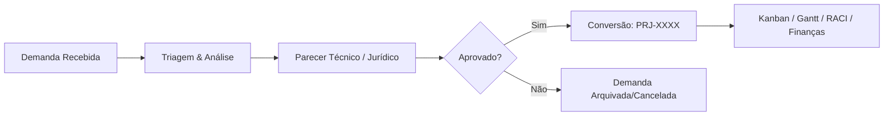

<div align="center">

# 🏛️ campanhaPRO

### **Plataforma Integrada de Gestão Política, Eleitoral, Inteligência Estratégica & Projetos Mandatários**

[](https://nextjs.org/)
[](https://reactjs.org/)
[](https://www.typescriptlang.org/)
[](https://laravel.com/)
[](https://tailwindcss.com/)
[]()

[Visão Geral](#-visão-geral) • [Arquitetura CoreModules](#-arquitetura-de-coremodules) • [Recursos Principais](#-recursos-principais) • [Tecnologias](#-tecnologias-utilizadas) • [Instalação](#-guia-de-instalação-e-execução) • [Documentação / Wiki](#-documentação-e-wiki)

</div>

---

## 📌 Visão Geral

O **campanhaPRO** é um sistema completo e de alto desempenho concebido para centralizar a operação de **mandatos políticos, gabinetes, articulações eleitorais e equipes de campo**. 

A plataforma oferece controle transacional estrito de solicitações de cidadãos (Demandas ➔ Projetos), módulo de Inteligência Eleitoral integrado diretamente com os dados abertos do **TSE/TRE (CKAN)**, agenda de candidatos com roteirização no Google Maps e transparência financeira rigorosa.

> 📚 **Documentação Completa:** Confira a [WIKI.md](file:///c:/Users/rodol/dashBom/WIKI.md) oficial ou acesse a [Wiki no GitHub](https://github.com/dossantoscarlos/dashBom/wiki) para especificações técnicas detalhadas.

---

## 🚀 Recursos Principais

| Módulo | Descrição & Funcionalidades |
| :--- | :--- |
| 📋 **Gestão de Demandas & Projetos** | Ciclo transacional de 10 etapas (*Recebida* ➔ *Parecer* ➔ *PRJ-XXXX*). Inclui Kanban, Cronograma Gantt, Matriz RACI e versionamento de arquivos. |
| 🗳️ **Inteligência Eleitoral TSE/TRE** | Monitoramento oficial em tempo real, consulta paginada de candidatos, busca estrita por sigla partidária e flexão de gênero. |
| 📅 **Agenda do Candidato & Rota** | Gerenciamento de eventos recorrentes, cancelamento/adiamento por data específica e integração direta com o Google Maps. |
| 💰 **Financeiro & Transparência** | Controle Orçado vs. Realizado por centro de custo, extrato de doadores por CPF/CNPJ, trilha de auditoria *append-only* e exportação (CSV/Excel/PDF). |
| 🏛️ **Mapeamento de Autoridades & Parceiros** | Mapeamento territorial de prefeitos, vereadores, lideranças, comitês, sindicatos e rede de apoio. |
| 🔔 **Push Notifications & Alertas** | Central de alertas em tempo real no navegador para compromissos, atualizações e informativos do TSE. |
| 🎨 **Personalização & Temas** | Suporte completo a modos ☀️ Claro, 🌙 Escuro e 💻 Sistema com atualização instantânea na interface. |

---

## 🧱 Arquitetura de CoreModules (`/CoreModules`)

O frontend é estruturado utilizando uma **Arquitetura de Módulos Independentes (`/CoreModules`)**, garantindo alto grau de desacoplamento, reuso de componentes e facilidade de manutenção.

```text
dashBom/
├── CoreModules/               # 🧩 18 Módulos Funcionais Desacoplados
│   ├── Agenda/                # Compromissos, roteirização e agenda do candidato
│   ├── Autoridades/           # Mapeamento e cadastro de lideranças institucionais
│   ├── Campaigns/             # Planejamento estratégico eleitoral e comícios
│   ├── Dashboard/             # Painel executivo com indicadores mandatários
│   ├── DemandasProjetos/      # Suíte transacional de demandas e projetos (10 telas)
│   ├── Financeiro/            # Gestão orçamentária, doações e prestação de contas
│   ├── Locations/             # Mapeamento geográfico de comitês e pontos de apoio
│   ├── Parecer/               # Emissão de pareceres técnicos e jurídicos
│   ├── Partners/              # Gestão de parceiros, sindicatos e associações
│   ├── Permissions/           # Controle de acessos e matriz de responsabilidade (RACI)
│   ├── Profile/               # Configurações de perfil de usuário e temas
│   ├── RedeSocial/            # Monitoramento e engajamento em mídias digitais
│   ├── Regions/               # Gestão territorial, bairros e metas de votos
│   ├── Reports/               # Gerador de relatórios gerenciais e exportações
│   ├── Surveys/               # Mobilização de pesquisas de opinião pública
│   ├── Tre/                   # Inteligência eleitoral TSE/TRE e busca paginada
│   ├── Users/                 # Controle de usuários e operadores do sistema
│   └── Voluntariado/          # Gestão e engajamento da rede de voluntários
├── app/                       # 🌐 App Router do Next.js 16
├── backend/                   # ⚙️ Backend Laravel (RESTful API & Migrations)
├── components/                # 🎨 Componentes globais da interface (UI/Design System)
├── contexts/                  # 🔄 Provedores de estado global (DashboardProvider, etc.)
└── WIKI.md                    # 📘 Documentação da arquitetura e especificações
```

---

## 🔄 Workflow Transacional (Demanda ➔ Projeto)



> ⚠️ **Regra de Negócio Inviolável:** Nenhuma solicitação pode ser criada diretamente como Projeto. Toda entrada nasce obrigatoriamente como **Demanda** e só transita para **Projeto** após parecer técnico positivo.

---

## 🛠️ Tecnologias Utilizadas

### **Frontend**
- **Framework:** [Next.js 16](https://nextjs.org/) (App Router)
- **Biblioteca de UI:** [React 19](https://reactjs.org/)
- **Linguagem:** [TypeScript 5](https://www.typescriptlang.org/)
- **Estilização:** [Tailwind CSS v4](https://tailwindcss.com/)
- **Ícones:** [Lucide React](https://lucide.dev/)

### **Backend & Banco de Dados**
- **Framework Backend:** [Laravel (PHP)](https://laravel.com/)
- **Arquitetura de API:** RESTful API (`/api/v1`)
- **Integração de Dados:** API Pública CKAN TSE (`dadosabertos.tse.jus.br`)
- **Auditoria:** Logs *Append-Only* para rastreabilidade financeira e de ações

---

## 💻 Guia de Instalação e Execução

### **Pré-requisitos**
- [Node.js](https://nodejs.org/) (v18+ recomendado)
- [PHP](https://www.php.net/) (v8.2+ para o backend Laravel)
- [Composer](https://getcomposer.org/)

---

### **1. Configuração do Frontend (Next.js)**

```bash
# Clonar o repositório
git clone https://github.com/dossantoscarlos/dashBom.git
cd dashBom

# Instalar as dependências do Node
npm install

# Iniciar o servidor de desenvolvimento
npm run dev
```

Acesse a aplicação no navegador em: `http://localhost:3000`

---

### **2. Configuração do Backend (Laravel)**

```bash
# Entrar na pasta do backend
cd backend

# Executar as migrations do banco de dados
php artisan migrate

# Popular a base de dados com as informações oficiais (Seeder TSE)
php artisan db:seed --class=TseCandidatosSeeder

# Iniciar o servidor local do Laravel
php artisan serve
```

O backend estará ativo em: `http://localhost:8000/api/v1`

---

## 📄 Scripts Disponíveis

No diretório do frontend, você pode executar:

- `npm run dev` — Inicia o ambiente de desenvolvimento Next.js.
- `npm run build` — Compila a aplicação para produção.
- `npm run start` — Inicia a aplicação em modo de produção.
- `npm run lint` — Executa a verificação estática do ESLint.

---

## 📚 Documentação e Wiki

Para detalhes aprofundados sobre cada um dos 18 CoreModules, regras de negócio do TSE/TRE, estrutura de banco de dados e guias de implantação, consulte os seguintes materiais:

- [📄 WIKI.md Local](file:///c:/Users/rodol/dashBom/WIKI.md)
- [🌐 GitHub Repository Wiki](https://github.com/dossantoscarlos/dashBom/wiki)
- [⚙️ Backend README.md](file:///c:/Users/rodol/dashBom/backend/README.md)

---

<div align="center">

Desenvolvido para excelência na **Gestão Política, Mandatária e Eleitoral**.

</div>
